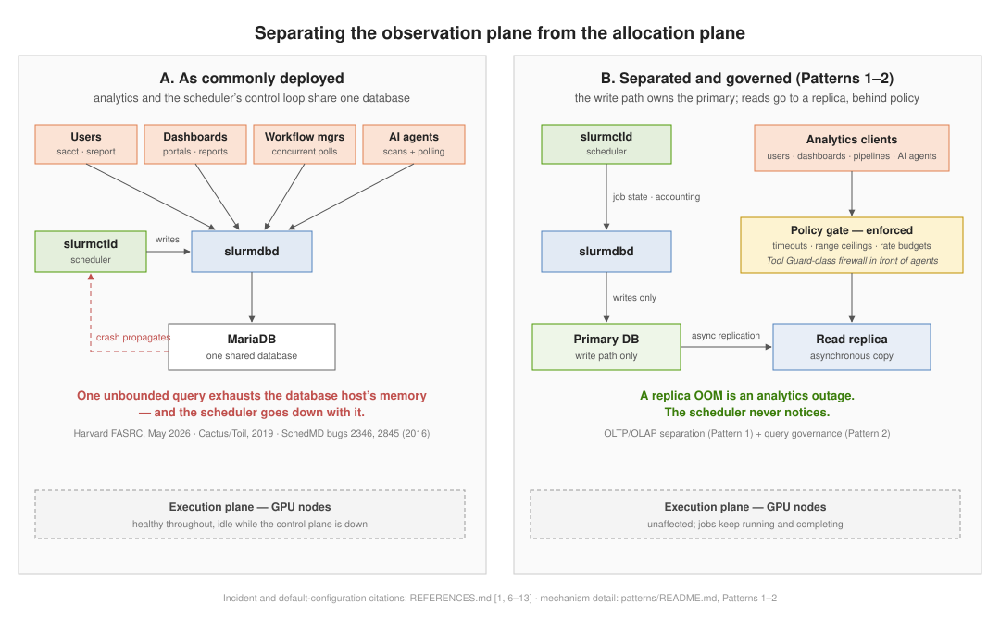
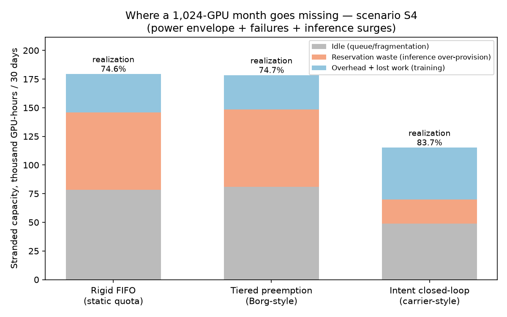
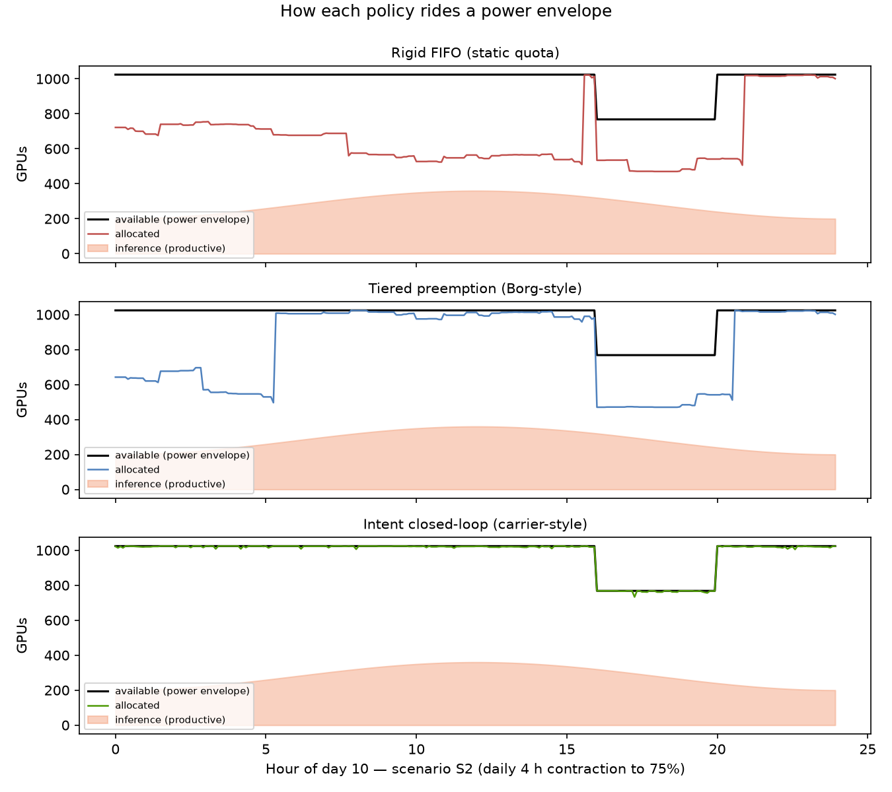
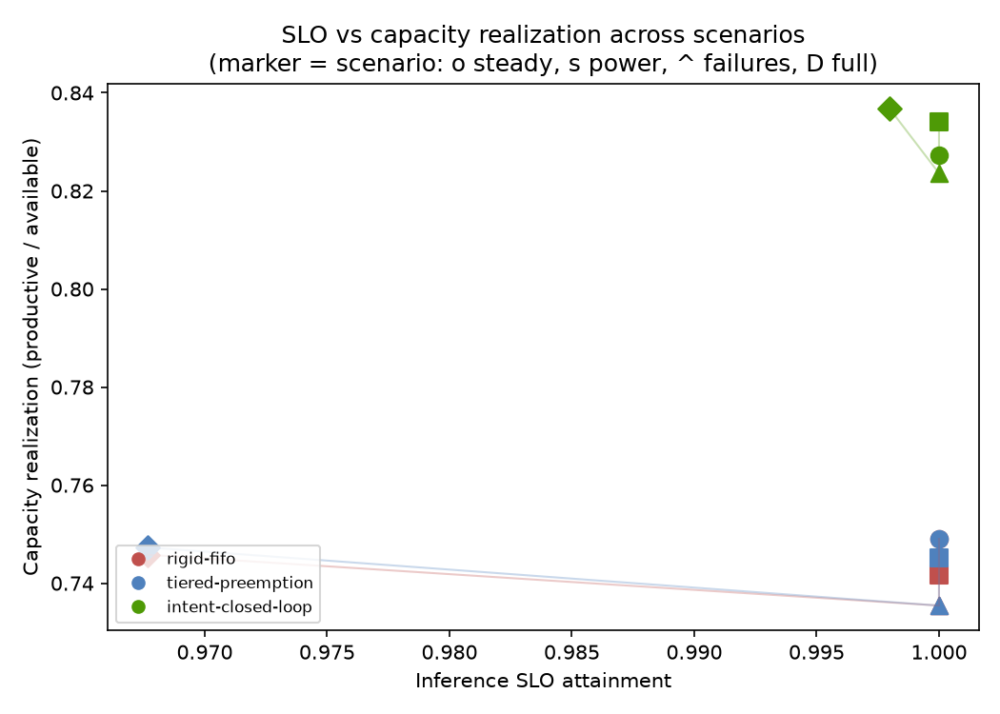

# Scheduled Capacity: Turning Scattered GPUs into Working AI Clusters

**The AI-infrastructure market prices GPUs, power, and interconnect. It does not price the layer that converts them into usable capacity: allocation.** This repository makes that layer measurable — and shows, with a reproducible simulator and verified public evidence, that scheduling maturity is worth more than the next tranche of GPUs.

**TL;DR, from the experiments below:** on a simulated 1,024-GPU cluster carrying a Meta-calibrated workload through power constraints, failures, and demand surges, an intent-based closed-loop allocation policy realizes **85.8%** of available capacity where a rigid quota policy realizes **77.8%** — recovering **~56,000 GPU-hours per month, the equivalent of ~78 GPUs, without buying anything**. The recovered capacity comes mostly from a mundane place: not peak-provisioning inference. The repo name is the conclusion: before buying more GPUs, fix the scheduler.

*Sequel to [network-vs-more-gpus](https://github.com/dimaggi-ai/network-vs-more-gpus) ("Network Capacity Is Compute Capacity"). All factual claims trace to [REFERENCES.md](REFERENCES.md).*

*The whole argument in one document — model, results, validation, and the limits — is the whitepaper: [paper/paper.md](paper/paper.md).*

---

## 1. Capacity accounting: usable = nominal × A × E × P

Over a window of H hours on N accelerators, usable capacity is nominal capacity discounted three times:

- **A — scheduler availability**: can the allocation plane admit and place work?
- **E — allocation efficiency**: of schedulable accelerator-hours, how many are allocated?
- **P — productive ratio**: of allocated hours, how many produce forward progress? (Meta's ETTR is this quantity for training [34].)

The [calculator](calculator/) computes the three loss layers for any fleet, with worked examples from verified public incidents. What it shows is an inversion of attention:

| Worked example (30-day window) | Layer | Stranded GPU-hours |
|---|---|---|
| Harvard emergency scheduler patch, Aug 2026 — whole fleet paused ~3.7 h [4, 4a] | scheduler (A) | **3,700** |
| Meta-style 16k fleet at ETTR 0.90 [34] | productivity (P) | **1,152,000** |
| Alibaba-scale fleet at 68% allocation ratio, pre-optimization [37] | allocation (E) | **35,806,464** |

The layer that makes the news (outages) is the smallest. The layer nobody sees (allocation) is the largest — the raw totals above differ by four orders of magnitude, but the fleets differ in size too, so normalize per GPU: the allocation gap strands ~230 GPU-hours per GPU per month against the headline outage's 3.7 — roughly **60× more**, per GPU, every month. Alibaba's own OSDI'26 paper reports raising allocation from 68% to 93% by scheduler-side work on a 155,410-GPU fleet [37] — a recovered ~28M GPU-hours per month that no amount of additional hardware purchasing could have delivered per dollar.

```
python3 calculator/stranded_capacity.py --list-presets
python3 calculator/stranded_capacity.py --preset typical-composite
```

A composite mid-size cluster (one 4 h control-plane event, 80% allocation, 0.90 productive ratio) realizes **71.6%** of its nominal month. The control-plane event — the thing that gets a postmortem — contributes 2% of that loss.

## 2. "Utilization" is three different numbers

Most "GPUs are idle" claims mix incommensurable metrics. Keep them apart:

| Metric | What it measures | Cited values |
|---|---|---|
| **Allocation ratio** | share of GPUs assigned to anyone | 68% pre- / 93% post-optimization, Alibaba ASI, 155k GPUs [37] |
| **Hardware utilization** | busy fraction of *allocated* GPUs | ~52% average, Microsoft Philly training cluster [35]; median 4.2%, Alibaba PAI mixed cluster [36] (secondary-source figure, primary re-verification pending) |
| **MFU / goodput / ETTR** | useful fraction of busy time | ETTR ~0.9 on multi-day 2–4k-GPU runs, Meta [34] |

These multiply. A fleet can report "full" while producing a fraction of its potential — every layer belongs to the allocation-and-scheduling problem, not to hardware.

## 3. The allocation plane is also where clusters break

The scheduler control plane, not the GPUs, is the recurring point of failure — a pattern, not an incident (details and primary sources: [case studies](docs/case-studies.md), patterns 1–3 of [patterns/](patterns/README.md)):

- SchedMD's tracker warned in **2016** that user queries "can DoS the box" (bugs 2346, 2845 [8, 9]).
- A workflow manager's ~1,000 concurrent `sacct` polls "crashed our SLURM db" at one site, **2019** [11].
- Harvard FASRC, **June 2023**: ~6.5 days of scheduler degradation; root cause never publicly identified [2, 3].
- Harvard FASRC, **May 2026**: one oversized `sacct` query OOM'd the accounting database host and crashed the scheduler — sub-hour hard outage, multi-day degraded operation, permanent query caps [1].
- Harvard FASRC, **Aug 2026**: emergency cluster-wide pause (~3.7 h) to patch a scheduler memory leak; the upgrade itself terminated jobs [4a, 4b].
- Meta, **2024**: after one node failure, a single 1024-GPU job was requeued 35 times, inflicting **548 preemptions** on other jobs — one hardware fault, amplified into fleet-scale churn entirely by allocation policy [34].

In none of these events was failing hardware the story — the allocation plane either originated the loss or multiplied it.

**And a new load class has arrived.** Harvard's May 2026 postmortem closes with: *"Please also ensure any AI agents you have running limit their queries appropriately"* [1]. Autonomous agents combine both dangerous load shapes — large scans and high-frequency polling — and asking them to be judicious does not scale. The bound has to be enforced at the interface: a runtime policy firewall such as DIMAGGI's own [Tool Guard](https://dimaggi.ai) intercepts an agent's tool calls before execution and applies allow / deny / redact / escalate decisions against declared policy (query-range ceilings, scoping, rate budgets), with a tamper-evident audit trail. A postmortem can only ask; an enforcement point makes the bound hold for requesters that will never read the postmortem.



## 4. The experiment: three allocation policies, one month, same cluster

The [simulator](sim/) runs a 1,024-GPU cluster for 30 days under four scenarios (steady state; a daily 4 h power contraction to 75%; Meta-rate node failures; all of it plus inference surges). The workload is calibrated to Meta's published job-size findings — most jobs tiny, most GPU-time in large jobs [34] — and all three policies face the *identical* job stream and events:

- **rigid-fifo** — FIFO + backfill, rigid sizes, no preemption, peak-provisioned inference reservation; sheds power by emergency-killing newest jobs. A conservative Slurm configuration.
- **tiered-preemption** — adds Borg-style priority tiers and graceful checkpoint-preemption [25]. Still rigid sizes, still peak-provisioned.
- **intent-closed-loop** — the carrier-network pattern (§5): a 15-minute controller tracks inference demand with 10% headroom instead of peak-provisioning, shrinks elastic training jobs before escalating to graceful preemption, and degrades in a declared hierarchy under scarcity.

Results (means over 3 seeds; full grid in [results/](results/), reproduce with `python3 sim/run.py`):

| Scenario S4 (power + failures + surges) | rigid-fifo | tiered-preemption | intent-closed-loop |
|---|---|---|---|
| **Capacity realization** | 0.778 | 0.779 | **0.858** |
| Inference SLO attainment | 0.968 | 0.968 | **0.998** |
| Training ETTR | 0.908 | **0.916** | 0.898 |
| Stranded GPU-h / month | 156,452 | 155,892 | **100,354** |
| — of which reservation waste | 67,416 | 67,416 | **21,154** |
| Emergency kills / preemptions / resizes | 359 / 0 / 0 | 28 / 263 / 0 | 28 / 438 / 1,232 |







What the numbers say:

1. **The intent policy's 7–9-point capacity dividend over the rigid baseline holds in every scenario, including steady state.** Most of it comes from one mundane decision: allocating inference to *demand plus headroom* instead of *peak plus margin*. Peak-provisioning looks responsible and quietly strands ~46,000 GPU-hours a month here.
2. **Demand-tracking also wins at inference's own game.** The static policies size their reservation to the diurnal peak plus 5% — which surges exceed by construction, so under surges they miss (SLO 0.968); sizing statically to *cover* surges would instead deepen the standing waste. That is the structural bind of static sizing: it must choose between waste and misses. The tracking controller absorbs the same surges at 0.998.
3. **The dividend is not free — and the costs are visible.** The intent policy pays ~1,230 resizes, ~440 graceful preemptions (more than tiered's ~260: running the cluster hotter leaves scarcity less slack, so more work is displaced when the envelope contracts), one to two ETTR points of churn overhead (vs the rigid and tiered baselines respectively), and longer waits under power pressure (4.5 h vs 2.5 h mean in S2). This is the correct engineering trade: bounded, priced churn in exchange for a fleet-level dividend.
4. **Tiers alone are not enough.** Graceful preemption converts lossy kills into clean ones (28 vs 359 in S4) but recovers almost no capacity — because the big losses were never in the kills; they were in the standing reservations and the rigidity.
5. **Failures barely differentiate policies; allocation does.** Meta-rate failures cost every policy roughly equally. The scheduler's job is not to prevent failures — it is to stop wasting the capacity that survives them.

**Honest limitations:** 5-minute steps; linear elastic scaling (optimistic — resize also pays an explicit overhead step); graceful preemption checkpoints at zero marginal cost at the moment of preemption (optimistic for both preempting policies; emergency kills do lose uncheckpointed work); the static policies' reservation is deliberately sized to the diurnal peak rather than to rare surges, mirroring common practice — sizing to surges would trade the SLO misses for deeper reservation waste; aggregate inference demand rather than per-request latency; abstracted node placement; single tenant. The simulator measures *policy structure*, not vendor performance; absolute numbers will differ per site, the ordering is the finding. Invariants are enforced by [tests](sim/test_sim.py) (conservation of GPU-hours, determinism per seed, policy behavioral contracts).

## 5. The pattern is older than AI: what carrier networks already learned

Telecommunications networks allocated a scarce, shared, congestible resource under SLOs a generation before GPU clusters — and their end state is documented in the patent record:

- **US 2020/0112876** (application-aware congestion management): detect congestion, identify *heavy users* and *suffering users*, iteratively shape the heavy until the suffering recover [40].
- **US 11,128,536** (intent-based traffic management): the operator declares *outcomes*; an allocation module sets per-class floors and targets; quality is measured continuously; shapers re-allocate in a closed loop; under scarcity, a strict class hierarchy degrades first-things-first [41].

Map it to AI compute: **training jobs are the heavy users** (elastic, throughput-hungry, checkpointable); **inference is the suffering user** (latency-bound, SLO-visible); *intent* is training-throughput targets, inference SLOs, and power/cost envelopes; the feedback signal is goodput rather than link QoE. The simulated intent policy above is this patent pattern transplanted — and the ecosystem is already converging on it: Google's Dynamic Workload Scheduler ("built on Google Borg technology," TPUs and GPUs [32]) schedules against declared duration and flexibility; queued resources and Spot tiers price priority [31]; Kueue, Volcano, and KAI ship gang scheduling, topology awareness, and preemption hierarchies on Kubernetes [19–21]. What the open stack still lacks is the *closed loop* — measured workload QoE driving continuous re-allocation. That is the gap, and the opportunity.

Six architecture patterns for getting there — from plane separation to power-as-a-schedulable-resource — are in [patterns/](patterns/README.md).

## 6. The TPU parallel

Google is the existence proof that the end state works, because it co-designed the scheduler and the fabric ([full hypothesis](docs/tpu-parallel.md)):

- Borg has run priority bands, quota-priced admission, and cascade-suppressed preemption since before 2015 [25].
- TPU v4's optical circuit switches removed the scheduler's contiguity constraint outright: *"For TPU v3, a 256 chip slice meant the scheduler had to find 256 contiguous chips that were idle. For TPU v4, it can pick 4³ blocks from anywhere in the supercomputer"* — and goodput survives at 99.0–99.5% host availability where a static fabric needs 99.9% [28].
- The productized stack — Multislice, queued resources, Spot, DWS, default-on ICI resiliency [31–33] — is intent-based allocation shipped as a cloud product.

**Hypothesis:** vertically integrated accelerator ventures win on *allocation efficiency*, not only on chips — the scheduling layer is the moat. The merchant-GPU world's counter-move is visible in real time: NVIDIA acquired the Run:ai scheduler (open-sourced as KAI, 2025) and then SchedMD — Slurm itself — in December 2025 [16, 21]. The scheduling layer is consolidating under the accelerator vendor. That is the market agreeing with this repo's thesis.

## 7. Scattered GPUs, one cluster — the honest boundary

"Multi-cloud AI cluster" today means federation at the **control plane**: SkyPilot and dstack place and queue jobs across hyperscalers, neoclouds, Kubernetes, and Slurm [23, 24]; CoreWeave's SUNK Anywhere extends one Slurm-on-K8s control plane across clouds [17]. Nothing verified federates the **data plane** — no RDMA fabric spans providers, and a distributed training job still lands inside one interconnect domain. "One logical cluster" means one logical *queue*. That is genuinely valuable — it is allocation-layer consolidation, this repo's whole subject — but claims beyond it are marketing.

## 8. The validation project

The simulator carries a nine-point validation registry
([sim/validation.py](sim/validation.py)) run in CI, honestly split into
three kinds. **Calibrated** points pin constants tuned to — or sharing an
input with — published figures, so they cannot drift silently: Meta's
job-size shape and RSC-1 failure rate [34], and training ETTR, which
lands at ~0.91-0.92 against Meta's published ~0.9 [34] but is labeled
calibrated, not emergent, because Meta computed that figure at an assumed
1-hour checkpoint interval — the same constant this model uses — so the
agreement is a shared input, not evidence. **Emergent** points are
behaviors nothing in the code was tuned to produce, asserted across four
seeds: large jobs queue >2× longer than small ones under rigid gang
scheduling in every seed — the direction of the Philly trace's queueing
finding, where >4-GPU jobs show a longer delay tail (25% wait ≥10 min vs
10% of 1-GPU jobs) and fragmentation drives ~78% of large-job delay
occurrences [35], though this saturated simulation produces far larger
ratios than the trace's minutes-scale tail; and the intent policy
realizes ≈5-8 points more of the capacity envelope than rigid FIFO in
every seed, directionally anchored to Alibaba raising the (different but
adjacent) allocation-ratio metric 68%→93% by scheduler-side work alone
[37]. **Sanity** points pin the model's own arithmetic and cite no
external evidence: emergency kills under power contraction lose
~1,350-2,100 GPU-h per two weeks that graceful checkpoint-preemption
preserves by construction (real Borg-style preemption warns and kills,
so it is harsher than the graceful branch here [25]); queueing grows
with offered load below saturation in every seed; and demand-tracking
cuts reservation stranding 3.4× at equal SLO — deterministic constant
arithmetic whose mechanism, not magnitude, comes from the carrier
pattern [41]. Synthetic data is the seeded workload generator itself,
deterministic per seed.

Two things keep that table from being a highlight reel. The registry
prints a **DECLINED** list on every run, naming what it does *not* check —
that no point constrains the failure model, which stays green at 10× Meta's
rate; that the *size* of the scheduling dividend and the elastic-resize
mechanism are reported but never validated; that the Philly and Alibaba
anchors are direction-only; that no real scheduler binary is exercised; and
that nothing here validates tail latency, placement, or multi-tenancy. And
[sim/test_validation.py](sim/test_validation.py) **breaks the model on
purpose** — eight mutations of three different strengths, because the
difference matters. Two delete simulator machinery: the job-size
distribution flattened, the checkpoint interval collapsed. Three swap in a
weaker policy: the intent policy replaced by rigid FIFO, graceful
preemption replaced by killing, the intent policy replaced by
peak-provisioning tiered preemption. Two collapse a comparison to guard
against tautology: the two offered loads set equal, the large-job band
compared against itself. One falsifies a pinned constant: the RSC-1 rate.
Only the first two remove a mechanism, and the last one moves no model
behavior at all. Each is required to turn a *named* point red, and
a control proves the reduced configuration used for the mutations is green
when nothing is broken. A registry nobody has watched fail is evidence
that the registry is easy, not that the model is right.

```
cd sim && python3 validation.py     # the registry, model vs public record
```

## 9. Reproduce everything

```
pip install -r sim/requirements.txt

# capacity accounting, worked examples
python3 calculator/stranded_capacity.py --preset harvard-aug2026
python3 calculator/test_stranded_capacity.py

# policy simulation: full grid (4 scenarios x 3 policies x 3 seeds, ~6 s)
cd sim && python3 test_sim.py && python3 test_validation.py && python3 run.py
```

Python 3.11+, `numpy`, `matplotlib`. Every run is seeded and deterministic.

## Series

- **Network Capacity Is Compute Capacity** — the fabric determines usable compute ([network-vs-more-gpus](https://github.com/dimaggi-ai/network-vs-more-gpus))
- **The Two Workloads** — training- vs inference-shaped capital risk ([dimaggi.ai/insights](https://dimaggi.ai/insights))
- **Scheduled Capacity** (this work) — the allocation layer is where capacity is realized or stranded

---

*Margaret (Maggie) Nanyonga — Founder & Principal Architect, [DIMAGGI AI](https://dimaggi.ai). Governed AI infrastructure: the control, reliability, and audit layer for autonomous systems operating production networks and compute.*
