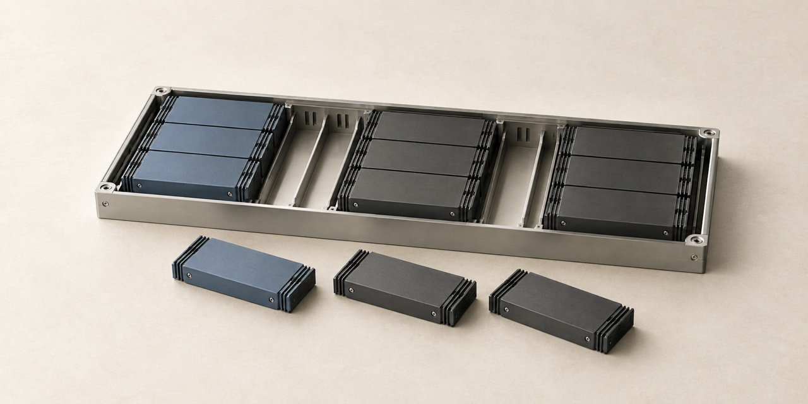

# Cover artwork — scheduler-vs-more-gpus



Unbranded conceptual illustration for this project. These miniature physical models
communicate the subject; they are not engineering diagrams or photographs of deployed hardware.

| File | Use | Dimensions |
| --- | --- | --- |
| [social-preview-v1.jpg](social-preview-v1.jpg) | GitHub social preview | 1280 × 640 |
| [linkedin-v1.jpg](linkedin-v1.jpg) | Website sharing / LinkedIn artwork | 1200 × 627 |
| [cover-v1.png](cover-v1.png) | Full-resolution master | 1774 × 887 |

Both JPEG exports are below 1 MB. The LinkedIn export removes a small amount from
the sides to fit its recommended aspect ratio; the subject is preserved.

## Activate the repository preview

Committing these files does not configure GitHub's social preview.
Open [repository settings](https://github.com/dimaggi-ai/scheduler-vs-more-gpus/settings),
find **Social preview → Edit → Upload an image**, and select `social-preview-v1.jpg`.
See [GitHub's instructions](https://docs.github.com/en/repositories/managing-your-repositorys-settings-and-features/customizing-your-repository/customizing-your-repositorys-social-media-preview).

For a website link, use `linkedin-v1.jpg` as the page's public `og:image`, with
its own title, description and canonical URL. See [LinkedIn's requirements](https://www.linkedin.com/help/linkedin/answer/a521928/making-your-website-shareable-on-linkedin).
Then check a fresh link in [LinkedIn Post Inspector](https://www.linkedin.com/post-inspector/)
and inspect the actual Featured card. Cached or existing cards may need to be re-added.

## Production notes

Created with Codex's built-in image generation tool. Final artwork was visually
reviewed. Exported with macOS `sips` for dimensions and JPEG compression.
No text, logo, author name, date, neon lighting or performance claims appear in the image.

Style reference: [Network cover](https://github.com/dimaggi-ai/network-vs-more-gpus/blob/main/assets/covers/cover-v1.png), used for materials, palette and lighting only.

Alt text: Compute tiles arranged into compact allocations inside a shallow tray, with spare tiles beside it.

### Generation prompt

```text
Use case: stylized-concept. Make a NEW editorial cover illustration for a GPU scheduling and allocation research repository. Reference image 1 is only a palette/material/lighting reference, not an edit target; the new subject and composition must be different.
Landscape exactly 2:1, preferably 1280 x 640. No text at all.
Primary concept: capacity becomes usable when resources can be arranged into contiguous allocations. A single shallow precision-machined rectangular allocator tray on a warm chalk tabletop, seen from high oblique view. Inside are three distinct, neatly fitted rectangular groups of low-profile compute tiles, one group muted slate blue, two matte graphite. A few narrow empty slots remain between groups. Three loose matching compute tiles sit just outside the near edge, waiting for a place. Each group is a simple coherent rectangle; no Tetris game, no chaotic scatter, no giant array. Sparse fin or contact-edge details imply computer hardware without fabricated brands.
Physically plausible architectural maquette, refined matte metal surfaces, quiet soft daylight and contact shadows, sharply controlled geometry, tactile restraint. Warm off-white background, charcoal, pale aluminum, ONE desaturated slate-blue accent. Entire small subject comfortably inside central 75 percent, much open background, still clear at thumbnail size.
Avoid all text, digits, logos, names, dates, UI screens, data claims, arrows, glowing edges, neon, gradients, holograms, particles, decorative circuitry, robot brains, lens flare, glossy 3D plastic, crowded composition. One visual idea, high craft, not generic AI stock art.
```
